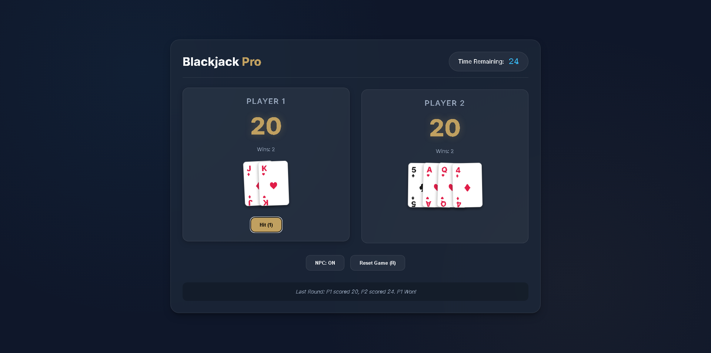

# 🃏 Blackjack Pro

A modern, sleek, and strategic 21 (Blackjack) web game. Transform your basic card game experience into a professional casino-style interface with NPC and Local Co-Op, glassmorphism design, and smooth animations.

## ✨ Features

- **🃏 Real Card Deck**: A full 52-card deck system with Aces, Suits (♥, ♦, ♣, ♠), and Face cards (J, Q, K).
- **💎 Premium UI**: Modern dark-themed design using CSS glassmorphism, blur effects, and the professional 'Inter' typography.
- **🤖 Strategic NPC**: A reactive AI that makes intelligent decisions. It hits when trailing and stops strategically when ahead to avoid busting.
- **🏆 Winner Pop-up**: An animated modal that crowns the winner of each round with clear score comparisons and victory reasons.
- **⏳ Dynamic Timer**: A 30-second window for each round, keeping the game fast-paced and exciting.
- **⌨️ Keyboard Support**:
  - `1`: Player 1 Hit
  - `2`: Player 2 Hit (when NPC is OFF)
  - `R`: Reset Game
- **📱 Fully Responsive**: Perfectly playable on desktops, tablets, and mobile devices.

## 🚀 How to Play

1.  Open `index.html` in any modern web browser.
2.  **Aim for 21**: Draw cards to get as close to 21 as possible. 
3.  **Ace Logic**: Aces are worth 1 or 11 (the score will show `1/11` when appropriate).
4.  **Challenge the AI**: Toggle **NPC: ON** for a strategic opponent.

## 🛠️ Tech Stack

- **HTML5 & CSS3**: Custom card components and animations.
- **Modern JavaScript (ES6+)**: Shuffle algorithms and dealer logic.

## 📄 License

This project is licensed under the Apache License 2.0. See the [LICENSE](LICENSE) file for details.

---
